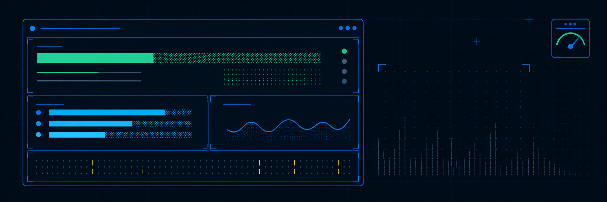
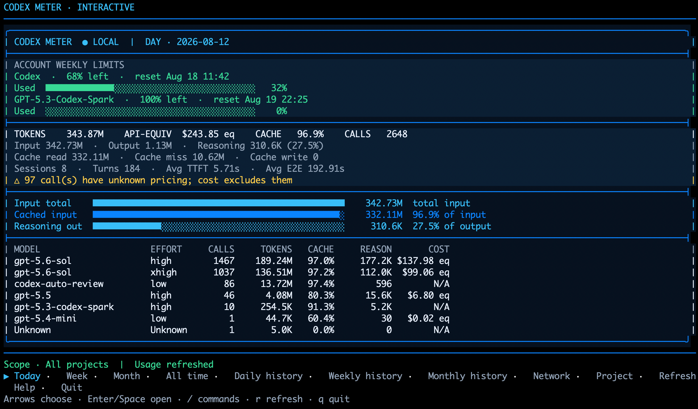
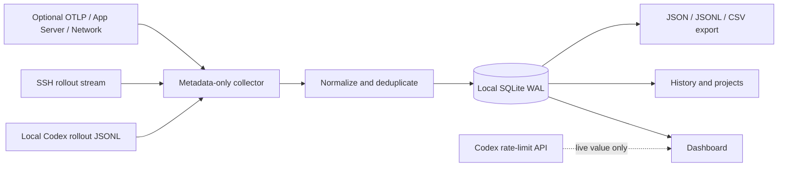

<p align="center">
  
</p>

<h1 align="center">Codex Meter</h1>

<p align="center">
  A fast, local-first usage and performance dashboard for Codex CLI.
</p>

<p align="center">
  <a href="https://github.com/DelicateNorman/codex-meter/releases/tag/v0.17.0-beta.1"></a>
  <a href="https://github.com/DelicateNorman/codex-meter/actions/workflows/rust.yml"></a>
  
  <a href="LICENSE"></a>
</p>

<p align="center">
  <strong>Weekly limits · Token usage · Projects · Cost estimates · Cache efficiency · Latency · Network diagnostics</strong>
</p>

<p align="center">
  <a href="docs/user-guide.en.md">English user guide</a> ·
  <a href="docs/user-guide.zh-CN.md">中文使用指南</a> ·
  <a href="docs/desktop.en.md">macOS desktop preview</a> ·
  <a href="docs/build-from-source.md">Build from source</a> ·
  <a href="CHANGELOG.md">Changelog</a>
</p>



Codex Meter turns the history already written by Codex—on this computer or configured SSH hosts—into an interactive terminal dashboard. It shows where your tokens went, which projects and models used them, how well caching worked, how long responses took, and how much of the active account's seven-day allowance remains.

Version 0.16.0 replaces the Python runtime with one small native Rust executable
while keeping the v0.15 database and configuration format. Existing
`~/.codex-meter` history is preserved during installation, upgrade, and rollback.

It is a separate companion application. It does **not** replace or patch the official `codex` command.

> Codex Meter is an independent community project and is not affiliated with or endorsed by OpenAI.

## See it in action



The dashboard opens immediately. Live account limits load in the background and replace the loading row automatically when Codex responds.

## macOS desktop app (preview)

Codex Meter now also has a native macOS desktop interface. It uses the system
WebView through Tauri instead of bundling a browser, and the production DMG is
about 6 MB. The app and CLI share the same Rust collector, privacy filters,
pricing catalog, SSH metadata synchronizer, and `~/.codex-meter` database, so
opening either one preserves the same history.

The desktop app includes live weekly limits; dated Day/Week/Month/All-time
reports; daily, weekly, and monthly history; project and optional account
filters; cache, retry, response-speed, and network insights; CSV export; recent
sessions; and remote-server status, testing, progress, cancellation, and
per-server refresh. Apple Silicon and Intel `.app`/`.dmg` bundles are built and
validated on real macOS GitHub runners.

The public preview DMGs are unsigned and not notarized because the project does
not yet use a paid Apple Developer ID. Download the matching build directly:
[Apple Silicon](https://github.com/DelicateNorman/codex-meter/releases/download/v0.17.0-beta.1/codex-meter-desktop-macos-arm64.dmg)
or [Intel](https://github.com/DelicateNorman/codex-meter/releases/download/v0.17.0-beta.1/codex-meter-desktop-macos-x86_64.dmg).
macOS may require right-clicking the app and choosing **Open**, or allowing it
under **System Settings → Privacy & Security**. See the
[English desktop guide](docs/desktop.en.md) or
[中文桌面版指南](docs/desktop.zh-CN.md) for details. The terminal application
remains fully supported and unchanged.

## Why Codex Meter?

| Capability | What you get |
|---|---|
| Live weekly limits | Used/remaining bars and local reset time for every seven-day bucket returned by the active Codex account |
| Flexible history | Today, current week, current month, all time, plus daily/weekly/monthly history |
| Remote sessions | Incrementally aggregate Codex Desktop/CLI work performed on SSH hosts into the Mac dashboard |
| Project scope | All projects by default, with a searchable project picker ordered by recent activity |
| Model breakdown | Model, reasoning effort, calls, tokens, cache rate, reasoning tokens, and API-equivalent cost |
| Performance | TTFT, end-to-end latency, output-token speed, tool timing, retries, and compactions when available |
| Local ownership | One default database per operating-system user; optional manual account labels are off by default |
| Privacy-first diagnostics | Rollout, OTLP, App Server, socket, packet-metadata, and proxy adapters that intentionally exclude content |
| Small standalone builds | No Python required; about 5–6 MB depending on platform |

## Install

Standalone installers verify the release checksum, install only for the current user, and preserve existing data under `~/.codex-meter`.

### Homebrew (stable CLI)

```bash
brew install DelicateNorman/codex-meter/codex-meter
```

### Linux and macOS

```bash
curl -fsSL https://raw.githubusercontent.com/DelicateNorman/codex-meter/v0.17.0-beta.1/install.sh | sh
```

### Windows PowerShell

```powershell
irm https://raw.githubusercontent.com/DelicateNorman/codex-meter/v0.17.0-beta.1/install.ps1 | iex
```

Open a new terminal and run:

```bash
codex-meter
```

No `sudo`, Administrator access, or Python installation is required. Linux and macOS install to `~/.local/bin`; Windows installs to `%LOCALAPPDATA%\Programs\CodexMeter\bin` and adds it to the current user's `PATH`.

Prebuilt binaries, checksums, and source archives are available on the [Releases page](https://github.com/DelicateNorman/codex-meter/releases).

## Use the interactive dashboard

Run `codex-meter` without a subcommand. Changed rollout files are imported incrementally, then the keyboard dashboard opens.

| Key | Action |
|---|---|
| `↑` `↓` `←` `→` | Move through the bottom menu |
| `Enter` / `Space` | Open the selected view |
| `/` | Open the searchable command palette |
| `Esc` | Close Help, Project, or the command palette |
| `r` | Refresh local records, configured SSH sources, and live limits |
| `q` | Quit from the main screen |

Inside the `/` palette and Project filter, printable keys—including `q`—are treated as text. Press `Esc` first to return to the main screen.

The interface adapts down to compact terminals: short windows keep the headline and weekly limits at the top, while narrow windows keep the dashboard visible and switch to compact navigation.

### Understand the percentages

- **Weekly Used** is the percentage reported by the active Codex account's seven-day limit. It is unrelated to the local `Week` report.
- **Cached input** is cached-input tokens divided by all input tokens.
- **Reasoning out** is reasoning tokens divided by all output tokens.
- **API-EQUIV** is an estimate using API prices. It is not a ChatGPT subscription bill.
- Unknown or internal model prices stay `N/A`; Codex Meter does not invent a price.

## Common commands

```bash
codex-meter                                      # interactive dashboard
codex-meter today                                # today's local usage
codex-meter summary --period week                # current calendar week
codex-meter summary --period month               # current calendar month
codex-meter summary --period all                 # usage since first import
codex-meter history --group month                # monthly history
codex-meter summary --period week --project NAME # one project
codex-meter network show                         # saved network timing
codex-meter doctor                               # capability check
codex-meter remote add devbox                    # add an SSH history source
```

<details>
<summary><strong>Complete command map</strong></summary>

| Command | Purpose |
|---|---|
| `codex-meter import [PATH]` | Import one rollout or a sessions tree |
| `codex-meter today` | Daily overview |
| `codex-meter summary` | Day, week, month, or all-time overview |
| `codex-meter history` | Usage grouped by day, week, or month |
| `codex-meter account ...` | Optional manual account labels |
| `codex-meter remote ...` | Add, test, list, remove, or sync SSH history sources |
| `codex-meter models` | Model × reasoning-effort totals |
| `codex-meter sessions` | Recent session totals |
| `codex-meter projects` | Usage and compactions by project |
| `codex-meter providers` | Provider attribution |
| `codex-meter agents` | Root/subagent attribution |
| `codex-meter tools` | Tool success and AVG/P50/P95 timing |
| `codex-meter waterfall TURN` | Per-turn LLM/tool timeline |
| `codex-meter perf` | OTLP latency percentiles and throughput inputs |
| `codex-meter cache` | Reuse, savings, amplification, and retry tax |
| `codex-meter network ...` | Probe, passive packet metadata, and saved flows |
| `codex-meter proxy ...` | CONNECT, reverse, or explicit TLS diagnostics |
| `codex-meter otel ...` | Local OTLP collector and configuration helper |
| `codex-meter app-server ...` | JSONL ingestion or transparent stdio proxy |
| `codex-meter export` | JSON, JSONL, or CSV metadata export |
| `codex-meter watch` | Periodically refresh and redraw |
| `codex-meter statusline` | One compact shell/footer line |
| `codex-meter pricing` | Show the bundled and locally installed versioned price catalog |
| `codex-meter pricing --update` | Download, checksum, validate, and install the current catalog |
| `codex-meter demo` | Deterministic UI preview without usage data |

</details>

## Projects, users, and optional accounts

Codex Meter defaults to **all projects**. Open `Project` or type `/project` to choose one. Project names come from the last directory component of each rollout working directory; names that match are intentionally grouped. Recently active projects appear first.

Every OS user gets a separate database because `~/.codex-meter` resolves inside that user's home. If a database is deliberately shared, aggregate queries still remain scoped to the recorded OS owner.

Account labels are optional, local metadata and disabled by default:

```bash
codex-meter account status
codex-meter account enable personal
codex-meter account set work
codex-meter account list
codex-meter summary --period month --account work
codex-meter account disable
```

Codex Meter never reads `auth.json`, credentials, access tokens, or email addresses to create these labels. Existing unlabeled sessions stay `Unassigned` unless you explicitly run `codex-meter account claim-unassigned LABEL`.

## Include Codex work from a remote server

When Codex Desktop opens a project through SSH, Codex runs on that server and writes its Rollouts there. Codex Meter can bring those records into the dashboard on your Mac; Codex Meter does **not** need to be installed on the server.

First make sure the same SSH alias works in the Mac terminal, then add it once:

```bash
ssh devbox
codex-meter remote add devbox
codex-meter
```

Use the host alias from `~/.ssh/config`, not a shell command. The first import may take longer; later refreshes inspect file size/time and transfer only changed Rollouts. The dashboard opens immediately while this sync runs in the background. Its title changes to `LOCAL + 1 REMOTE`, and the source row reports completion or an actionable connection error.

```bash
codex-meter remote list          # configured sources
codex-meter remote test devbox   # verify SSH and find Rollouts
codex-meter remote sync          # update all sources now
codex-meter remote remove devbox # stop future syncs
```

A temporary Python 3 standard-library filter runs on the server: it scans the
source bytes there, removes prompts, responses, reasoning, commands, and tool
output, then sends only a gzip-compressed metadata stream over SSH. The CLI and
dashboard show per-file/source-byte progress. If Python 3 is unavailable, sync
stops with an actionable message instead of transferring a raw Rollout. Only
normalized usage/timing/project metadata is retained. Removing a source stops
future updates but deliberately keeps its already imported statistics.

As a real-world check, 60 Rollouts totaling 678 MiB on the development host produced a 2.17 MiB filtered stream—a 99.7% reduction—while matching every exported call from a full local parse.

## Privacy model

Codex Meter stores usage and timing metadata. It intentionally does **not** import or persist:

- prompts, model responses, or reasoning content;
- shell commands, tool arguments, or tool output;
- HTTP headers, cookies, credentials, or authentication files;
- SSE payloads or WebSocket frames.

It does store identifiers needed for safe aggregation, token counters, model and effort names, timestamps, project/Git metadata, status, byte counts, and timing measurements.



Local state uses user-only directory permissions by default:

```text
~/.codex-meter/
├── meter.db
├── config.toml
├── pricing.json
└── logs/
```

Override the location with `CODEX_METER_HOME` or `--home`.

## Data quality and pricing

Every metric records its source, confidence, and whether it was estimated. Missing values remain `NULL` and render as `Unknown` or `N/A`.

| Metric | Source | Quality |
|---|---|---|
| Session, project, Git | rollout `session_meta` | exact |
| Turn, model, effort | turn/task events | exact |
| Input, cache, output, reasoning | cumulative TokenCount delta | derived |
| Per-response usage | `raw_response_completed`, when present | exact |
| TTFT and E2E | task completion fields | exact when present |
| TBT/TPS and deeper latency | OTLP JSON | exact or bucket approximation |
| Weekly account limits | App Server `account/rateLimits/read` | live backend value |
| Network/TLS setup | probe, passive metadata, or local proxy | exact at selected layer |

Pricing is data-driven and versioned in
[`codex_meter/data/pricing.json`](codex_meter/data/pricing.json). Run
`codex-meter pricing --update` to download the current catalog; Codex Meter
verifies its SHA-256 and schema before atomically replacing the local copy. The
calculator separates regular input, cached reads, cache writes, and output.
Reasoning tokens are already part of output and are never charged twice.

Cost coverage is explicit instead of one ambiguous `N/A`: a call can be missing
model metadata, use a model without a published price, or use the earliest known
price as a clearly marked historical estimate when the call predates the
catalog. Calls and tokens are always counted even when cost cannot be estimated.

## Optional live observability

The default rollout importer is enough for normal usage reporting. The adapters below are optional and keep the same content-exclusion policy.

<details>
<summary><strong>OTLP latency and throughput</strong></summary>

```bash
codex-meter otel config
codex-meter otel serve
```

Copy the generated snippet into `~/.codex/config.toml`, then start the collector before Codex. It accepts OTLP/HTTP JSON logs, metrics, and traces on localhost and stores only a small attribute allowlist. Prompt fields, arbitrary attributes, event bodies, auth metadata, and tool payloads are discarded.

</details>

<details>
<summary><strong>App Server lifecycle and exact response usage</strong></summary>

```bash
codex-meter app-server proxy
codex-meter app-server ingest FILE
```

The transparent proxy relays JSON-RPC and requests experimental raw events only when the client did not already choose a value. It derives lifecycle IDs, usage, timings, tool type/status/duration, reroutes, and compactions. Request content remains in memory and is not persisted.

</details>

<details>
<summary><strong>Network and proxy diagnostics</strong></summary>

```bash
codex-meter network probe api.openai.com
codex-meter network capture --host api.openai.com --host chatgpt.com --duration 15
codex-meter proxy tunnel --port 8899
```

The default modes do not decrypt TLS. Passive capture records only destination, direction, packet count/length, and elapsed time. Capture permissions remain controlled by the operating system.

Explicit TLS termination is separate and requires acknowledgement:

```bash
codex-meter proxy tls-init
codex-meter proxy tls --acknowledge-sensitive \
  --upstream https://chatgpt.com/backend-api/codex
```

Trust the generated local CA only for the diagnostic window and remove that trust afterward. Even in this mode, Codex Meter never persists headers or content.

</details>

## Supported platforms

| Platform | Standalone release | Notes |
|---|---|---|
| Linux x86_64 | ✅ | Current-user install under `~/.local/bin` |
| macOS Apple Silicon | ✅ | Native arm64 binary |
| macOS Intel | ✅ | Native x86_64 binary |
| Windows x86_64 | ✅ | Native console and keyboard handling |
| Windows on ARM | Compatibility | Runs the x86_64 build through Windows emulation |
| WSL2 | ✅ | Install the Linux build inside the same distribution as Codex |

## Build from source

Install stable Rust 1.85 or newer:

```bash
git clone https://github.com/DelicateNorman/codex-meter.git
cd codex-meter
cargo test --all-targets --locked
cargo build --release --locked
./target/release/codex-meter
```

On Windows the final path is `target\release\codex-meter.exe`. Python is not
required. See the complete [source-build guide](docs/build-from-source.md) for
desktop and platform notes. The frozen Python v0.15 source remains available on
the [`legacy-python-v0.15`](https://github.com/DelicateNorman/codex-meter/tree/legacy-python-v0.15)
branch.

## Development status

Codex Meter is pre-1.0 software. Releases include checksum-verified binaries;
the CI signing and notarization paths are ready but remain inactive until the
project has Apple Developer ID and Windows certificate secrets. Experimental
Codex surfaces stay behind adapters and capability detection, and missing
metrics fail gracefully to `Unknown`/`N/A`.

A version-pinned upstream patch for a native Codex `/meter` command is available under [`integrations/`](integrations/), but it is never applied to the installed Codex binary automatically.

The Codex 0.146.1 schema audit is recorded in [`docs/codex-0.146.1-schema.md`](docs/codex-0.146.1-schema.md). Changes are listed in the [changelog](CHANGELOG.md).

## Contributing

Bug reports, privacy reviews, documentation fixes, and focused pull requests are welcome. Read [CONTRIBUTING.md](CONTRIBUTING.md) and run the full test suite before opening a PR.

## License

[MIT](LICENSE) © Codex Meter contributors.
